# Flujograma Integral Harmoni para Clientes

Harmoni opera como una sola cadena de RR. HH. y planillas para Perú: el dato nace una vez, se valida en origen y viaja al siguiente proceso sin volver a digitarse.

El recorrido no empieza en contratos. Empieza en la preparación de la empresa: RUC, responsables, estructura, usuarios, accesos y calidad de datos. Desde esa base se puede contratar, operar, pagar, desarrollar, comunicar, dirigir y cerrar la relación laboral sin procesos paralelos.

## Vista Ejecutiva

```mermaid
flowchart LR
    A["01 Preparar<br/>Empresa, RUC, áreas, usuarios, permisos"] --> B["02 Atraer<br/>Vacantes, candidatos, entrevistas, oferta"]
    B --> C["03 Incorporar<br/>Alta, ficha única, contrato, legajo, onboarding"]
    C --> D["04 Operar<br/>Turnos, asistencia, permisos, vacaciones, variables"]
    D --> E["05 Pagar<br/>Pre-planilla, cálculo, aprobación, boletas, bancos, SUNAT"]
    E --> F["06 Desarrollar<br/>Evaluaciones, OKR, PDI, capacitaciones, clima"]
    F --> G["07 Comunicar<br/>Notificaciones, comunicados, campañas, acuses"]
    G --> H["08 Dirigir<br/>Analytics, alertas, reportes, auditoría"]
    H --> D
    H --> I["09 Desvincular<br/>Cese, offboarding, liquidación, baja SUNAT"]
    I --> H

    C -. "Datos del colaborador" .-> E
    D -. "Novedades aprobadas" .-> E
    E -. "Boletas y pendientes" .-> G
    F -. "Planes y brechas" .-> G
    I -. "Documentos de salida" .-> G
```

## Flujo Detallado

```mermaid
flowchart TB
    subgraph S1["01 Preparar"]
      S1A["Registrar empresa / RUC"] --> S1B["Completar datos legales"]
      S1B --> S1C["Configurar áreas, cargos, sedes y centros de costo"]
      S1C --> S1D["Crear usuarios, roles y responsables"]
      S1D --> S1E["Sanear datos críticos"]
    end

    subgraph S2["02 Atraer"]
      S2A["Crear requisición"] --> S2B["Aprobar vacante"]
      S2B --> S2C["Publicar y recibir postulantes"]
      S2C --> S2D["Entrevistar / puntuar / seleccionar"]
      S2D --> S2E["Contratar candidato"]
    end

    subgraph S3["03 Incorporar"]
      S3A["Alta express o importación"] --> S3B["Ficha única del trabajador"]
      S3B --> S3C["Contrato con continuidad"]
      S3C --> S3D["Legajo y firma"]
      S3D --> S3E["Onboarding y acceso al portal"]
      S3E --> S3F["T-Registro alta"]
    end

    subgraph S4["04 Operar"]
      S4A["Programar turnos"] --> S4B["Importar marcas biométricas"]
      S4B --> S4C["Resolver faltas, tardanzas y no marcajes"]
      S4C --> S4D["Aprobar vacaciones, permisos y papeletas"]
      S4D --> S4E["Registrar préstamos, viáticos y conceptos variables"]
      S4E --> S4F["Pre-planilla limpia"]
    end

    subgraph S5["05 Pagar"]
      S5A["Crear o regularizar período"] --> S5B["Generar planilla"]
      S5B --> S5C["Revisar variaciones y bloqueos"]
      S5C --> S5D["Aprobar"]
      S5D --> S5E["Emitir boletas"]
      S5E --> S5F["Exportar banco, PLAME, AFP Net y contabilidad"]
      S5F --> S5G["Cerrar período"]
    end

    subgraph S6["06 Desarrollar"]
      S6A["Evaluar desempeño"] --> S6B["Detectar brechas"]
      S6B --> S6C["Crear PDI / capacitación"]
      S6C --> S6D["Medir clima y seguimiento"]
    end

    subgraph S7["07 Comunicar"]
      S7A["Segmentar audiencia"] --> S7B["Enviar comunicado o recordatorio"]
      S7B --> S7C["Registrar lectura / acuse"]
      S7C --> S7D["Volver al legajo o tablero"]
    end

    subgraph S8["08 Dirigir"]
      S8A["Leer dashboards"] --> S8B["Detectar alertas"]
      S8B --> S8C["Asignar acción al módulo origen"]
      S8C --> S8D["Auditar resultados"]
    end

    subgraph S9["09 Desvincular"]
      S9A["Registrar cese"] --> S9B["Iniciar offboarding"]
      S9B --> S9C["Cerrar activos y accesos"]
      S9C --> S9D["Calcular liquidación"]
      S9D --> S9E["Emitir documentos y baja T-Registro"]
      S9E --> S9F["Cerrar historia laboral"]
    end

    S1E --> S2A
    S2E --> S3A
    S3F --> S4A
    S4F --> S5A
    S5G --> S6A
    S6D --> S7A
    S7D --> S8A
    S8C --> S4A
    S8C --> S5A
    S8C --> S9A
    S9F --> S8A
```

## Flujos Alternos Importantes

| Situación | Ruta recomendada | Qué evita |
|---|---|---|
| Alta sin reclutamiento | Preparar -> Incorporar -> Operar | Crear candidatos ficticios solo para contratar. |
| Renovación masiva de contratos | Incorporar -> Contratos -> Renovar con continuidad -> Nómina | Cortes entre contrato anterior y nuevo contrato. |
| Cierre mensual con período congelado sin boletas | Pagar -> Período -> Regularizar cierre -> Generar -> Aprobar -> Cerrar | Quedar atrapado en un estado cerrado sin planilla calculada. |
| Trabajador con cese dentro del mes | Operar -> Pagar -> Desvincular | Excluirlo mal de la planilla del período trabajado. |
| Inspección SUNAFIL | Dirigir -> Documentos -> Inspección -> Legajo / Contratos / Boletas | Buscar sustento en carpetas o Excel externos. |
| Reclamo de boleta | Comunicar / Portal -> Boleta -> Período -> Registro del trabajador | Recalcular o explicar el pago desde archivos sueltos. |
| Rotación o clima crítico | Dirigir -> Desarrollar -> Comunicar -> Operar | Que analytics sea solo reporte y no acción. |

## Regla de Oro

Cada proceso debe terminar con una salida que ya sirva al siguiente:

| Proceso | Entrada | Salida enlazada |
|---|---|---|
| Preparar | RUC, empresa, responsables | Base legal, estructura y permisos listos. |
| Atraer | Necesidad de personal | Candidato seleccionado con evidencia. |
| Incorporar | Candidato o alta directa | Ficha única, contrato, legajo y portal. |
| Operar | Colaborador activo | Asistencia y novedades aprobadas. |
| Pagar | Pre-planilla limpia | Planilla aprobada, boletas y archivos externos. |
| Desarrollar | Señales de desempeño y clima | Planes, capacitación y acciones. |
| Comunicar | Audiencia y pendiente | Mensaje con acuse y trazabilidad. |
| Dirigir | Datos de todo el ciclo | Alertas y decisiones hacia el origen. |
| Desvincular | Decisión de cese | Liquidación, documentos, baja y cierre laboral. |

## Enlaces Naturales en Harmoni

| Etapa | Pantallas principales |
|---|---|
| Preparar | Calidad de datos, Empresas, Áreas, Usuarios, Accesos. |
| Atraer | Vacantes, Pipeline, CV express, Banco de talento, Entrevistas. |
| Incorporar | Control Tower, Alta express, Empleados, Contratos, Legajo, Onboarding. |
| Operar | Asistencia, Roster, Papeletas, Vacaciones, Préstamos, Viáticos, Aprobaciones. |
| Pagar | Workflow mes, Pre-planilla, Períodos, Revisión, Boletas, Integraciones. |
| Desarrollar | Evaluaciones, OKR, PDI, Capacitaciones, Encuestas, Disciplina, Equidad. |
| Comunicar | Notificaciones, Comunicados, Campañas, WhatsApp, Documentos laborales. |
| Dirigir | Analytics, Alertas, Dashboard ejecutivo, Reportes, Auditoría, SUNAFIL. |
| Desvincular | Cese, Offboarding, Liquidaciones, Baja T-Registro, documentos de salida. |

## Mensaje para Cliente

Harmoni no es una suma de módulos. Es un circuito laboral completo: lo que se captura en la contratación se usa en asistencia; lo aprobado en asistencia entra a la planilla; lo cerrado en planilla genera boletas, archivos de banco y SUNAT; lo observado en analytics regresa como acción al responsable correcto.

## Guion Corto de Presentación

1. Preparar: mostrar empresa, RUC, usuarios, permisos y calidad de datos.
2. Atraer: crear o revisar una vacante y el pipeline.
3. Incorporar: convertir el candidato o hacer alta express con ficha, contrato, legajo y onboarding.
4. Operar: revisar turnos, asistencia, vacaciones, préstamos y aprobaciones.
5. Pagar: entrar a pre-planilla, generar, aprobar, emitir boletas, exportar y cerrar.
6. Desarrollar: abrir evaluación, PDI, capacitación o clima.
7. Comunicar: enviar recordatorios, comunicados o documentos con acuse.
8. Dirigir: revisar analytics, alertas, auditoría y reportes.
9. Desvincular: registrar cese, offboarding, liquidación, baja T-Registro y cierre histórico.

El cierre de la demo debe volver a Dirección: ahí se demuestra que Harmoni no solo procesa, sino que deja evidencia y decisiones listas para la siguiente acción.
